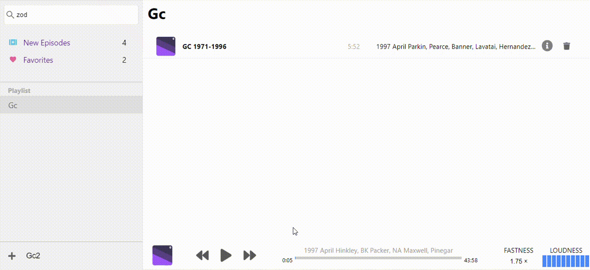

# Single Page Application was bootstrapped with Create React App. - Podcast App

## Frameworks and Libraries:

- React 16.8.4
- react-router-dom
- axios

## Features:

- Uses the iTunes API to search for Podcasts
- Find all podcasts in the Find Podcasts Page
- Checked and Unchecked favorite podcasts
- Selecte favorite podcast and get all the episodes
- play and add wherever episode you want
- Find all episodes added in New Episodes
- Drag and Drop episodes to specific item list
- Manage Playlists for custom playback
- Speedy playback

## Tutorial

### Find Podcasts

### Favorites

### Episodes

### PlayLists

### Player

## Development

`git clone https://github.com/khaledfarhati/react.js-spa-Podcast-App.git`

`npm install`

`npm run start`
